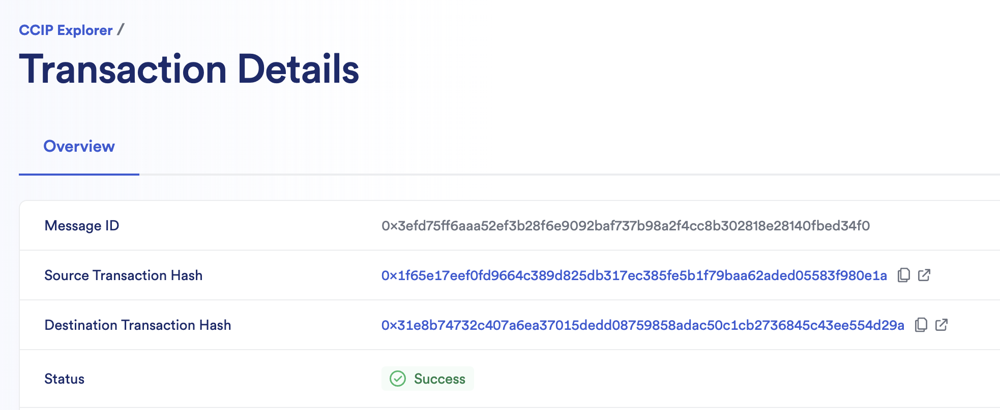
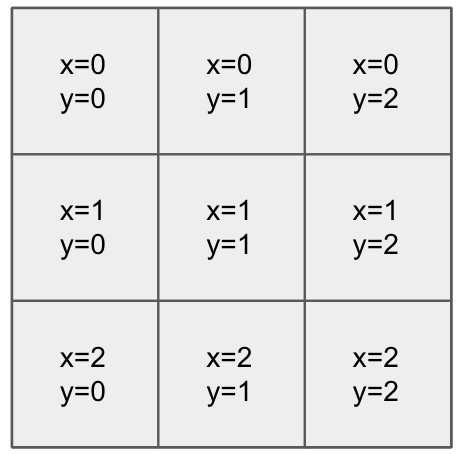

## CCIP Tic-Tac-Toe 

> **Note**
>
> _This repository represents an example of using a Chainlink product or service. It is provided to help you understand how to interact with Chainlink’s systems so that you can integrate them into your own. This template is provided "AS IS" without warranties of any kind, has not been audited, and may be missing key checks or error handling to make the usage of the product more clear. Take everything in this repository as an example and not something to be copy pasted into a production ready service._

This project demonstrates how Chainlink CCIP can be used to create a cross-chain Tic-Tac-Toe game


## Prerequisites

- [Git](https://git-scm.com/book/en/v2/Getting-Started-Installing-Git)
- [Current LTS Node.js version](https://nodejs.org/en/about/releases/)

Verify installation by typing:

```shell
node -v
```

and

```shell
npm -v
```

## Getting Started

1. Install packages

```
npm install
```

2. Compile contracts

```
npx hardhat compile
```
Comment out `import './tasks'` line in the file `hardhat.config` if you have issue of it. Please don't forget uncomment the line after compiling.

3. Run tests

```
TS_TRANSPILE_NODE=1 npx hardhat test
```

## What is Chainlink CCIP?

**Chainlink Cross-Chain Interoperability Protocol (CCIP)** provides a single, simple, and elegant interface through which dApps and web3 entrepreneurs can securely meet all their cross-chain needs, including token transfers and arbitrary messaging.


With Chainlink CCIP, one can:

- Transfer supported tokens
- Send messages (any data)
- Send messages and tokens

CCIP receiver can be:

- Smart contract that implements `CCIPReceiver.sol`
- EOA

**Note**: If you send a message and token(s) to EOA, only tokens will arrive

To use this project, you can consider CCIP as a "black-box" component and be aware of the Router contract only. If you want to dive deep into it, check the [Official Chainlink Documentation](docs.chain.link).

## Usage

In the next section you can see a couple of basic Chainlink CCIP use case examples. But before that, you need to set up some environment variables.

We are going to use the [`@chainlink/env-enc`](https://www.npmjs.com/package/@chainlink/env-enc) package for extra security. It encrypts sensitive data instead of storing them as plain text in the `.env` file, by creating a new, `.env.enc` file. Although it's not recommended to push this file online, if that accidentally happens your secrets will still be encrypted.

1. Set a password for encrypting and decrypting the environment variable file. You can change it later by typing the same command.

```shell
npx env-enc set-pw
```

2. Now set the following environment variables: `PRIVATE_KEY`, Source Blockchain RPC URL, Destination Blockchain RPC URL. You can see available options in the `.env.example` file:

```shell
ETHEREUM_SEPOLIA_RPC_URL=""
OPTIMISM_GOERLI_RPC_URL=""
ARBITRUM_TESTNET_RPC_URL=""
AVALANCHE_FUJI_RPC_URL=""
POLYGON_MUMBAI_RPC_URL=""
```

To set these variables, type the following command and follow the instructions in the terminal:

```shell
npx env-enc set
```

After you are done, the `.env.enc` file will be automatically generated.

If you want to validate your inputs you can always run the next command:

```shell
npx env-enc view
```

## Example: Cross-chain Tic Tac Toe Game
In this example, we will use a simple game called TicTacToe to demonstrate how to transmit messages from one chain to another using CCIP. 

In the game, we will deploy the TicTacToe smart contract on two different blockchains. By sending a transaction on the source chain, which can be either "start" or "move," the state of the game board will be modified, and these states will be "synchronized" by Chainlink CCIP on the other chain.

Before starting the game, the contract needs to be deployed on two different blockchains using the following commands:

### 1. Deploy TicTacToe smart contract
```shell
npx hardhat run ./scripts/deployTicTacToe.ts --network <blockchain>
npx hardhat run ./scripts/deployTicTacToe.ts --network <blockchain>
```

Where the list of supported chains consists of (case sensitive):

- ethereumSepolia
- optimismGoerli
- arbitrumTestnet
- avalancheFuji
- polygonMumbai

Although you can choose any two chains from the list, I highly recommend using Sepolia and Fuji because time consumed by CCIP to relay messages between these 2 chains are relatively shorter. If you want to deploy the contract at Sepolia and Fuji, the commands:

```shell
npx hardhat run ./scripts/deployTicTacToe.ts --network ethereumSepolia
npx hardhat run ./scripts/deployTicTacToe.ts --network avalancheFuji
```

### 2. Transfer native tokens to TicTacToe smart contract
After the deployment of the contract, you must transfer native tokens to these 2 contracts respectively. If you deployed contracts on Fuji and Sepolia, please transfer 2 AVAX and 0.01 ETH to contracts on Fuji and Sepolia respectively.

### 3. Update router
Please use commands below to update router address for `ccipSend`. For most of cases, the router addresses input here are same as router addresses of CCIP. 
```shell
npx hardhat ttt-update-router --blockchain ethereumSepolia --contract <address of TicTacToe on Ethereum Sepolia> --router 0xd0daae2231e9cb96b94c8512223533293c3693bf
npx hardhat ttt-update-router --blockchain avalancheFuji --contract <address of TicTacToe on Avalanche Fuji> --router 0x554472a2720e5e7d5d3c817529aba05eed5f82d8
```
Since you can have your own proxy to forward request to CCIP, update the addresses above with your own proxy addresses if you want to use proxies. If you don't want to use proxies, keep the router addresses the same as CCIP. 

Router addresses are listed below:
- Ethereum Sepolia: 0xd0daae2231e9cb96b94c8512223533293c3693bf
- Polygon Mumbai: 0x70499c328e1e2a3c41108bd3730f6670a44595d1
- Optimism Goerli: 0xeb52e9ae4a9fb37172978642d4c141ef53876f26
- Avalanche Fuji: 0x554472a2720e5e7d5d3c817529aba05eed5f82d8
- Arbitrum Goerli: 0x88e492127709447a5abefdab8788a15b4567589e


### 4. Player 1 starts a game
You can start a new game through a TicTacToe contract on any chain. The player who starts a game is player 1. Player 1 needs to send a transaction to create a session, allowing the other player on the other chain to join that session and make a move.

Start a game with the command blow:
```shell
npx hardhat ttt-start --source-blockchain ethereumSepolia --sender <address of TicTacToe on Ethereum Sepolia> --destination-blockchain avalancheFuji --receiver <address of TicTacToe on Avalanche Fuji>
```
You will see the message below in the terminal and that means the message is sent by CCIP.
```
✅ Message sent, game session created! transaction hash: 0x1f65e17eef0fd9664c389d825db317ec385fe5b1f79baa62aded05583f980e1a
```
While the message sent to CCIP, the status would not be synced until the the message is finalized on source chain and written into the contract on the other chain. Check the information in CCIP explorer and find message below to make sure the message sent to the dest chain. 



Usually it takes about 20mins to complete the cross-chain transaction.


### 5. Get session ID by index
In order to join a game, a player needs to know the session ID of the game.

Get the session ID of the game by index with the command below: 
```shell
npx hardhat ttt-get-sessionId --blockchain ethereumSepolia --contract <address of TicTacToe on Ethereum Sepolia> --index 0
```

### 6. Player 2 makes a move in blockchain 2
Player 2 on the other chain can make a move within the game session. The player needs to select a position with x and y coordinates(the range of x and y are from 0 to 2) with the command below:
```shell
npx hardhat ttt-move --x <x coordinate> --y <y coordinate> --player 2 --session-id <sessionId> --source-blockchain avalancheFuji --sender <address of TicTacToe on Avalanche Fuji> --destination-blockchain ethereumSepolia --receiver <address of TicTacToe on Ethereum Sepolia>
```
the x and y are coordinates in the board. eg:



### 7. Player 1 makes a move in blockchain 1
After player 2 made the move, player 1 can make the move with x and y coordinates. Please noted that transaction will fail if the position of represented by x and y coordinates is occupied.

Player 1 makes a move with command below:
```shell
npx hardhat ttt-move --x <x coordinate> --y <y coordinate> --player 2 --session-id <sessionId> --source-blockchain ethereumSepolia --sender <address of TicTacToe on Ethereum Sepolia> --destination-blockchain avalancheFuji --receiver <address of TicTacToe on Avalanche Fuji>
```

### 8. Repeat 6 and 7
Repeat steps 6 and 7 until either combination of player 1 or player 2 matches a winning combination.
### 9. Check the winner
Check the winner by command:
```shell
npx hardhat ttt-check-winner --blockchain ethereumSepolia --contract <address of TicTacToe on Ethereum Sepolia> --session-id <sessionId>
```
you can also check the winner from the contract on the other blockChain with command:
```shell
npx hardhat ttt-check-winner --blockchain avalancheFuji --contract <address of TicTacToe on Avalanche Fuji> --session-id <sessionId>
```

### Front-end of Tic-Tac-Toe
If you're interested in trying to interact with CCIP Tic-Tac-Toe using the frontend, please refer to the frontend [README.md](./frontend/README.md) here to learn how to use it.
